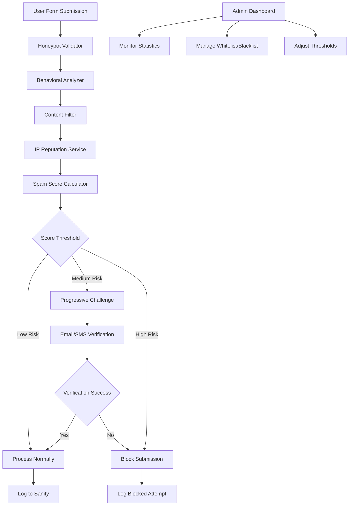

# Advanced Anti-Spam System Design

## Overview

The Advanced Anti-Spam System is a multi-layered defense mechanism designed to combat fake inquiries while maintaining a seamless experience for legitimate users. The system implements progressive validation, behavioral analysis, content filtering, and reputation-based blocking to achieve a comprehensive spam prevention solution.

The design follows a scoring-based approach where each validation layer contributes to a spam score. When the score exceeds defined thresholds, progressive challenges are applied, ranging from additional verification to complete blocking.

## Architecture

### High-Level Architecture



### System Components

1. **Frontend Enhancements**: Client-side behavioral tracking and honeypot fields
2. **Validation Pipeline**: Server-side processing chain for spam detection
3. **Scoring Engine**: Centralized spam score calculation and threshold management
4. **Challenge System**: Progressive verification mechanisms
5. **Admin Interface**: Management dashboard for monitoring and configuration
6. **Data Layer**: Enhanced logging and analytics storage

## Components and Interfaces

### 1. Honeypot Validator

**Purpose**: Detect automated bot submissions through hidden form fields

**Implementation**:
- Multiple honeypot fields with different names (email2, phone_backup, website)
- CSS-based hiding (not display:none to avoid detection)
- Server-side validation that rejects any submission with honeypot data
- Randomized field names to prevent bot adaptation

**Interface**:
```javascript
class HoneypotValidator {
  generateHoneypotFields(): HoneypotField[]
  validateSubmission(formData: FormData): ValidationResult
  logViolation(ip: string, fields: string[]): void
}
```

### 2. Behavioral Analyzer

**Purpose**: Analyze user interaction patterns to distinguish humans from bots

**Metrics Tracked**:
- Form interaction time (minimum 3 seconds for legitimate submissions)
- Mouse movement patterns and click events
- Keyboard interaction patterns (typing rhythm, backspaces)
- Tab navigation behavior
- Page focus/blur events

**Implementation**:
- Client-side JavaScript tracking with encrypted payload
- Server-side decryption and analysis
- Machine learning-based pattern recognition for advanced bot detection

**Interface**:
```javascript
class BehavioralAnalyzer {
  trackInteraction(event: InteractionEvent): void
  generateBehaviorSignature(): BehaviorSignature
  analyzeBehavior(signature: BehaviorSignature): BehaviorScore
}
```

### 3. Content Filter

**Purpose**: Analyze submission content for spam indicators

**Detection Patterns**:
- Promotional keywords (free, discount, limited time, etc.)
- Gibberish detection using character frequency analysis
- URL and email pattern matching
- Phone number format validation
- Duplicate content detection (fuzzy matching)
- Language consistency checks

**Implementation**:
- Rule-based filtering with configurable patterns
- Fuzzy string matching for duplicate detection
- Regional phone number validation
- Content similarity scoring

**Interface**:
```javascript
class ContentFilter {
  analyzeContent(content: SubmissionContent): ContentScore
  checkDuplicates(content: string, timeWindow: number): DuplicateResult
  validatePhoneFormat(phone: string, region: string): boolean
}
```

### 4. IP Reputation Service

**Purpose**: Evaluate IP addresses for spam risk factors

**Checks Performed**:
- Known spam database lookups (Spamhaus, etc.)
- VPN/Proxy detection
- Geolocation consistency validation
- Submission frequency analysis
- ISP reputation scoring

**Implementation**:
- Integration with external reputation APIs
- Local caching for performance
- Geolocation validation against provided information
- Rate limiting per IP with exponential backoff

**Interface**:
```javascript
class IPReputationService {
  checkReputation(ip: string): Promise<ReputationScore>
  detectVPN(ip: string): Promise<boolean>
  validateGeolocation(ip: string, providedLocation: string): boolean
  getSubmissionFrequency(ip: string, timeWindow: number): number
}
```

### 5. Spam Score Calculator

**Purpose**: Aggregate scores from all validation layers

**Scoring Algorithm**:
- Honeypot violation: +100 (immediate block)
- Low behavioral score: +30-50
- Content spam indicators: +20-40
- Bad IP reputation: +25-60
- High submission frequency: +15-30

**Thresholds**:
- 0-25: Low risk (process normally)
- 26-60: Medium risk (progressive challenge)
- 61+: High risk (block submission)

**Interface**:
```javascript
class SpamScoreCalculator {
  calculateScore(validationResults: ValidationResult[]): SpamScore
  getActionForScore(score: number): SpamAction
  updateThresholds(newThresholds: ThresholdConfig): void
}
```

### 6. Progressive Challenge System

**Purpose**: Verify legitimate users without blocking them

**Challenge Levels**:
1. **Level 1**: Enhanced reCAPTCHA (image selection)
2. **Level 2**: Email verification with time-limited token
3. **Level 3**: SMS verification with OTP
4. **Level 4**: Manual review queue

**Implementation**:
- Temporary submission storage during verification
- Time-limited verification tokens
- Fallback mechanisms for verification failures

**Interface**:
```javascript
class ChallengeSystem {
  initiateChallenge(level: ChallengeLevel, submission: Submission): Challenge
  verifyChallenge(challengeId: string, response: string): boolean
  escalateChallenge(challengeId: string): Challenge
}
```

## Data Models

### Submission Record
```javascript
interface SubmissionRecord {
  id: string
  timestamp: Date
  ipAddress: string
  userAgent: string
  formData: FormData
  spamScore: number
  validationResults: ValidationResult[]
  status: 'processed' | 'challenged' | 'blocked'
  challengeHistory?: Challenge[]
}
```

### Spam Score Breakdown
```javascript
interface SpamScore {
  total: number
  breakdown: {
    honeypot: number
    behavioral: number
    content: number
    ipReputation: number
    frequency: number
  }
  action: 'allow' | 'challenge' | 'block'
}
```

### Whitelist/Blacklist Entry
```javascript
interface ListEntry {
  id: string
  type: 'ip' | 'domain' | 'pattern'
  value: string
  reason: string
  createdBy: string
  createdAt: Date
  expiresAt?: Date
}
```

## Error Handling

### Client-Side Error Handling
- Graceful degradation when JavaScript is disabled
- Fallback to basic reCAPTCHA if behavioral tracking fails
- Clear error messages for verification failures
- Form data preservation during challenges

### Server-Side Error Handling
- Fail-safe approach: allow submission if validation services are down
- Comprehensive logging of all errors and exceptions
- Circuit breaker pattern for external API calls
- Automatic retry mechanisms with exponential backoff

### Error Recovery
- Temporary whitelist for false positives
- Manual review queue for borderline cases
- Administrator override capabilities
- Automated threshold adjustment based on false positive rates

## Testing Strategy

### Unit Testing
- Individual validator component testing
- Mock external API responses
- Edge case handling verification
- Performance benchmarking

### Integration Testing
- End-to-end form submission flows
- Challenge system workflows
- Admin dashboard functionality
- Database integration testing

### Load Testing
- High-volume submission simulation
- Performance under spam attack conditions
- API rate limiting validation
- Database performance optimization

### Security Testing
- Honeypot field detection resistance
- Behavioral tracking bypass attempts
- SQL injection and XSS prevention
- API endpoint security validation

## Performance Considerations

### Client-Side Optimization
- Minimal JavaScript footprint for behavioral tracking
- Asynchronous loading of non-critical components
- Local storage for behavioral data caching
- Progressive enhancement approach

### Server-Side Optimization
- Redis caching for IP reputation data
- Database indexing for submission queries
- Async processing for non-critical validations
- Connection pooling for external APIs

### Scalability
- Horizontal scaling support for validation services
- CDN integration for static assets
- Database sharding for high-volume logging
- Microservice architecture for independent scaling

## Security Considerations

### Data Protection
- Encryption of behavioral tracking data
- Secure storage of temporary submission data
- PII anonymization in logs
- GDPR compliance for data retention

### Attack Mitigation
- Rate limiting at multiple levels
- DDoS protection integration
- Bot detection evasion resistance
- Regular security audits and updates

### Privacy
- Minimal data collection approach
- Clear privacy policy updates
- User consent for behavioral tracking
- Data retention policy enforcement